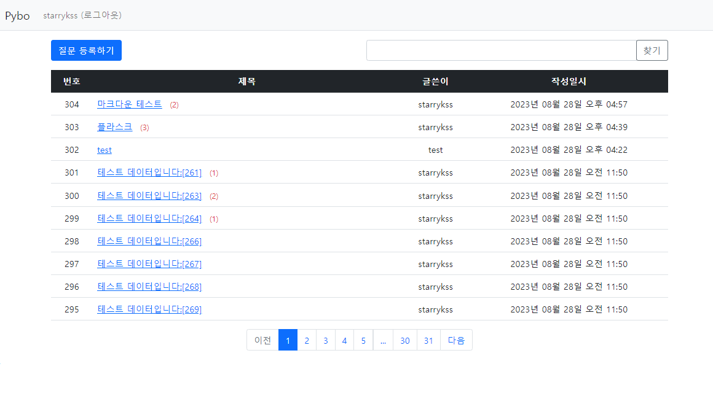

# Project Pybo

## 프로젝트 개요
- 플라스크를 이용하여 간단하게 진행해본 **Pybo 프로젝트**
- Pybo란, *Python Board* 의 약자이다.
- Pybo는 웹 커뮤니티에서 사용되는 오픈 소스 포럼 소프트웨어의 이름으로, 파이썬 언어로 작성되어 있으며, 사용자들이 **온라인 포럼** 을 구축하고 운영할 수 있도록 도와주는 도구이다.



## 프로젝트 구조
```text
├── pybo/
│      ├─ __init__.py
│      ├─ models.py
│      ├─ forms.py
│      ├─ views/
│      │   └─ main_views.py
│      ├─ static/
│      │   └─ style.css
│      └─ templates/
│            └─ index.html
└── config.py
```

## 구현 기능
- **질문 기능**
    - 질문 등록
    - 질문 수정
    - 질문 삭제
    - 질문 추천
- **답변 기능**
    - 답변 등록
    - 답변 삭제
    - 답변 추천
- **페이징 기능**
- **앵커 기능**
- **회원가입 기능**
    - 로그인
    - 로그아웃
- **검색 기능**
- **마크다운 기능**
    - 질문글
    - 답변글

## 사용한 스택
- *Python*
- *Flask*
    - *flask-markdown*
- *SQLite*
- **ORM(Object Relational Mapping)**
    - *SQLAlchemy*
    - *Flask-Migrate*
- *Bootstrap*